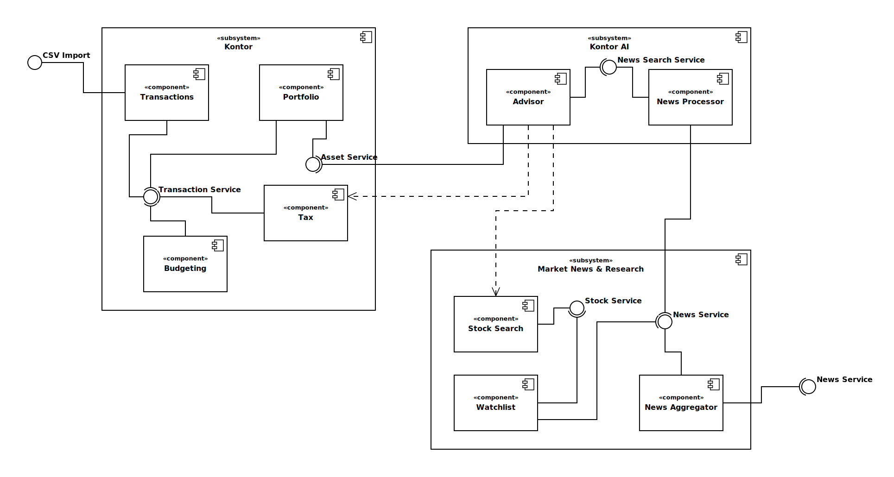
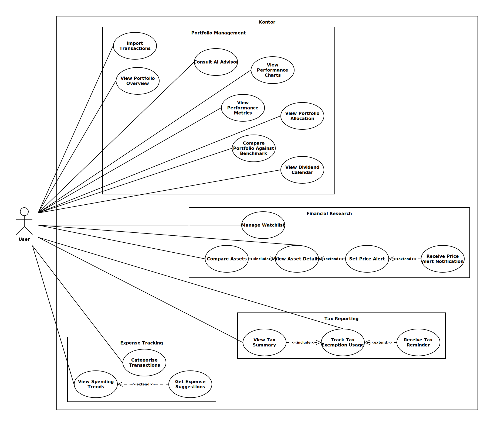
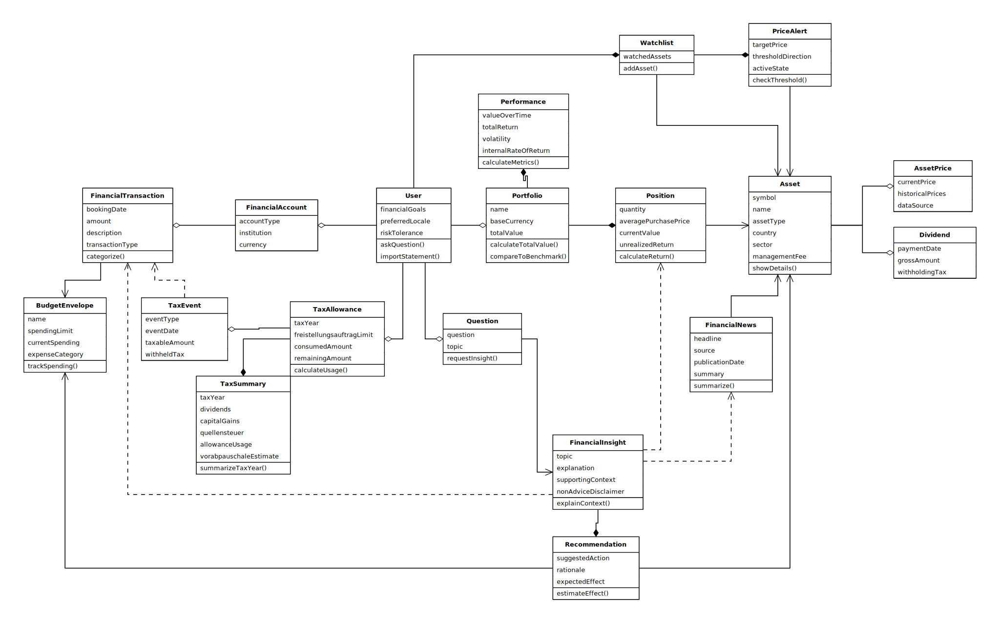

# Kontor

**Kontor** is a Progressive Web App that consolidates personal finance data - transactions, portfolios, and market data - and uses a GenAI layer to surface personalised, actionable insights. Stock and ETF data is sourced via Yahoo Finance; the AI component uses Retrieval-Augmented Generation (RAG) over the user's own financial data and curated financial news.

---

## Tech Stack

| Layer              | Technology                                                   |
| ------------------ | ------------------------------------------------------------ |
| Client             | React 19, TypeScript 5.9, Vite 7, Tailwind CSS 4, shadcn/ui  |
| Server             | Java 25, Spring Boot 4, Gradle                               |
| Linting/Formatting | Biome (client), Spotless + Checkstyle + Error Prone (server) |

---

## Setup

```sh
docker compose up --build
```

| Service | URL                     |
| ------- | ----------------------- |
| Client  | <http://localhost:5173> |
| Server  | <http://localhost:8080> |

### Local Development

#### Client (`client/`)

```sh
cd client
npm install
npm run dev
```

| Task             | Command             |
| ---------------- | ------------------- |
| Type check       | `npm run typecheck` |
| Lint             | `npm run lint`      |
| Lint (autofix)   | `npm run lint:fix`  |
| Format (autofix) | `npm run format`    |
| Build            | `npm run build`     |

#### Server (`core/`)

```sh
cd core
./gradlew build
```

| Task          | Command                                   |
| ------------- | ----------------------------------------- |
| Test          | `./gradlew test`                          |
| Compile check | `./gradlew compileJava`                   |
| Format check  | `./gradlew spotlessCheck`                 |
| Format fix    | `./gradlew spotlessApply`                 |
| Lint          | `./gradlew checkstyleMain checkstyleTest` |

---

### Top Level Architecture



### Use Case Diagram



### Analysis Object Model



---

## AI Agent Setup

This project is configured for AI coding agents (Claude Code, Codex). Rules, skills, and MCP servers ensure agents follow consistent standards across the codebase.

### Rules

Coding rules live in `.claude/rules/` and are automatically loaded based on the files being edited. They enforce consistent style, testing, security, and architectural patterns. For more information, see the [Claude Code Docs](https://code.claude.com/docs/en/memory).

```
.claude/rules/
├── common/              # Apply to all code
│   ├── coding-style.md  # Immutability, KISS/DRY/YAGNI, naming, file organization
│   ├── testing.md       # TDD workflow, AAA pattern, 80%+ coverage
│   ├── patterns.md      # Repository pattern, API envelope, service classes
│   └── code-review.md   # Review checklist, security triggers, severity levels
├── java/                # Apply to *.java, pom.xml, build.gradle*
│   ├── coding-style.md  # Records, sealed classes, Optional, modern Java (16+)
│   ├── patterns.md      # Constructor injection, Spring conventions, Flyway, jOOQ
│   └── testing.md       # JUnit Jupiter 5, AssertJ, Mockito, Testcontainers
└── typescript/          # Apply to *.ts, *.tsx, *.js, *.jsx
    ├── coding-style.md  # Biome, kebab-case files, React patterns, Zod, shadcn/ui
    ├── patterns.md      # Custom hooks, data fetching, repository pattern
    └── testing.md       # Playwright for E2E testing
```

- **Common rules** apply to all code. Language-specific rules extend them — they don't replace them.
- When common and language-specific rules conflict, the language-specific rule takes precedence.

### MCP Servers

MCP (Model Context Protocol) servers provide tool integrations for AI coding agents. They are configured in two places to support both Claude Code and Codex:

| File                 | Agent                   |
| -------------------- | ----------------------- |
| `.mcp.json`          | Claude Code (Anthropic) |
| `.codex/config.toml` | Codex (OpenAI)          |

Both files define the same servers — keep them in sync when adding or removing MCP servers.

### Skills

Skills extend AI coding agents with reusable instructions. They live in `.claude/skills/` (Claude Code) and `.agents/skills/` (Codex) and are tracked via `skills-lock.json`.

```bash
# Add a skill
npx skills add shadcn/ui

# List installed skills
npx skills list

# Update skills
npx skills update

# Remove a skill
npx skills remove <skill-name>
```

To install skills from the lock file and symlink all agent skills to Claude Code:

```bash
./install-skills.sh
```
