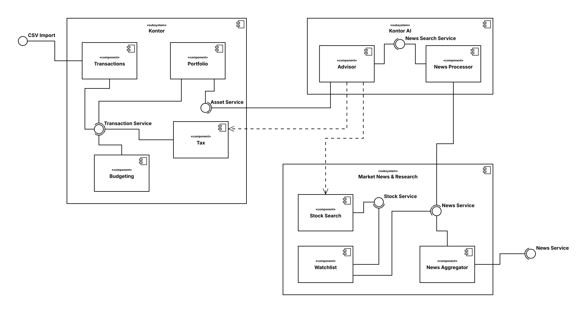
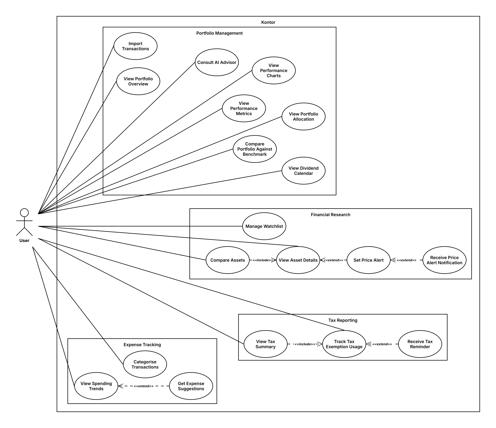
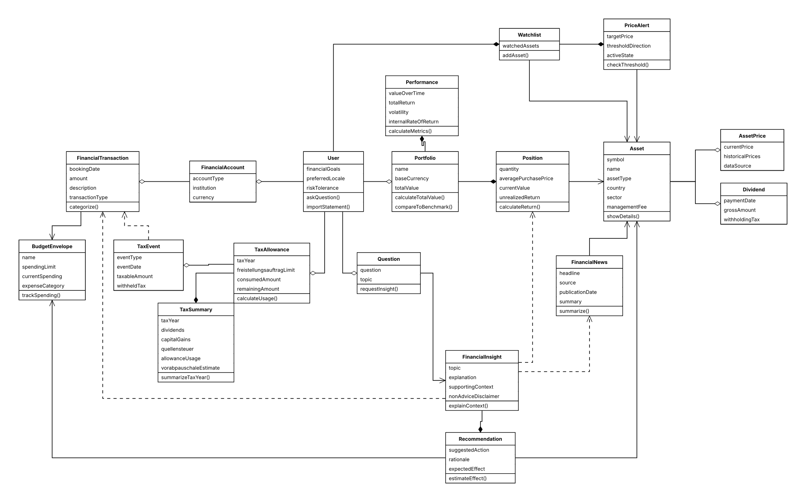

# Kontor

**Kontor** consolidates personal finance data - transactions, portfolios, and market data - and uses a GenAI layer to surface personalised, actionable insights. Stock and ETF data is sourced from [Twelve Data](https://twelvedata.com); the AI component uses Retrieval-Augmented Generation (RAG) over the user's own financial data and curated financial news.

---

## Tech Stack

| Layer              | Technology                                                   |
| ------------------ | ------------------------------------------------------------ |
| Client             | React 19, TypeScript 5.9, Vite 7, Tailwind CSS 4, shadcn/ui  |
| Server             | Java 25, Spring Boot 4, Gradle                               |
| AI Service         | Python 3.14, FastAPI, uv                                     |
| Linting/Formatting | Biome (client), Spotless + Checkstyle + Error Prone (server), Ruff (AI) |

---

## Setup

### Prerequisites

Running the full stack locally needs only [Docker](https://docs.docker.com/get-docker/) (Docker Desktop or Docker Engine) with Compose v2. The rest of the toolchain (Node, Java 25, uv) is required only for the non-Docker [Local Development](#local-development) workflow.

### Configuration

Create your local environment file from the tracked template:

```sh
cp .env.example .env
```

The defaults in `.env` match the Compose defaults, so the stack runs as-is. Update `.env` to change the Postgres credentials, Keycloak database credentials, or the shared local Keycloak dev-user password — and to set the API keys described below.

The AI service uses a **Logos API key** (`LOGOS_API_KEY=lg-…`) in `.env` when available. The Logos endpoint is only reachable from the TUM network or via eduVPN. When the key is missing, the AI service **automatically falls back to a local LLM** (see [Local LLM (offline AI)](#local-llm-offline-ai) below). If no local LLM is configured either (`LOCAL_LLM_BASE_URL` empty), recommendation calls return `503`; if a local LLM is configured but not running, they return `502` ("Local LLM is not reachable").

Live stock/ETF market data (quotes, price history, the holdings chart) is sourced from [Twelve Data](https://twelvedata.com) via a **`TWELVE_DATA_API_KEY`** in `.env`. See [Market data (Twelve Data)](#market-data-twelve-data) below for how to get a free key and what the free-tier rate limit means for the app.

The Compose Keycloak service is for local development only. It builds the custom Keycloak image from `infra/keycloak/theme/` (Keycloak with the Kontor login theme baked in), runs `start-dev`, imports `infra/keycloak/realms/kontor-realm.json`, and stores Keycloak state in the `keycloak_postgres_data` Docker volume. The realm import is skipped once the realm already exists, so delete that volume if you need to re-apply the import from scratch. The first `docker compose up --build` builds the theme image (Node + Maven), which takes a few minutes; subsequent runs use the cached layer.

Local Keycloak users live in `infra/keycloak/realms/kontor-users-0.json`. Add another object to the `users` array to create more local accounts with their own `realmRoles` and `attributes`. The sample users share the `KEYCLOAK_DEV_USERS_PASSWORD` environment placeholder so adding users does not require more Compose variables.

```sh
docker compose up --build
```

| Service     | URL                     |
| ----------- | ----------------------- |
| Client      | <http://localhost:5173> |
| Server      | <http://localhost:8080> |
| AI Service  | <http://localhost:8000> |

The client redirects to Keycloak for login. Sign in with a seeded local user — username **`dev`**, password **`dev`** (the password comes from `KEYCLOAK_DEV_USERS_PASSWORD`, default `dev`). Two more seeded users exist: `analyst` (regular user) and `admin-user` (also holds the `kontor-admin` role required to trigger news-aggregation runs). Add or edit users in `infra/keycloak/realms/kontor-users-0.json`.

### Market data (Twelve Data)

Live stock/ETF market data — quotes, price history, and the holdings chart — comes from [Twelve Data](https://twelvedata.com). You need a free `TWELVE_DATA_API_KEY` in `.env` for it to work; the free tier is enough for local development.

**How to get an API key:**

1. Create a free account at <https://twelvedata.com/pricing> (the free plan needs no card).
2. After signing in, open your [API dashboard](https://twelvedata.com/account) — it shows your unique API key.
3. Copy the key into the root `.env` file:

   ```sh
   TWELVE_DATA_API_KEY=your-key-here
   ```

4. (Re)start the stack so `core` picks up the key:

   ```sh
   docker compose up --build
   ```

The holdings chart on the dashboard should now render live prices.

**Rate limit.** The free tier caps how often you can call the API (currently 8 API credits per minute and 800 requests per day). When you exceed it, Twelve Data responds with `429`; `core` passes that through as a `429`, and the holdings chart dialog shows a "Live market data paused" notice with the provider's rate-limit message instead of the chart. Wait for the limit window to reset and reopen the chart — no key change is needed.

**No key configured.** When `TWELVE_DATA_API_KEY` is empty, market-data endpoints return `502` with a message explaining the key is missing, and the chart shows that message instead of prices. The rest of the app works normally.

### Local LLM (offline AI)

When `LOGOS_API_KEY` is empty, the AI service falls back to a local [Ollama](https://ollama.com/) model so the AI features keep working without TUM network access. There are two ways to provide it.

**Native Ollama (recommended on macOS).** A native Ollama uses the Mac GPU and is much faster than a container:

```sh
brew install ollama        # or download the app from ollama.com
ollama pull llama3.2       # one-time model download
ollama serve               # start this yourself and keep it running
```

The default `docker compose up` reaches it via `host.docker.internal:11434`. No extra flags needed.

**Containerised Ollama (no host setup).** Layer the opt-in override file — it runs Ollama in a container, pulls the model once, and points the AI service at it:

```sh
docker compose -f docker-compose.yml -f docker-compose.local-llm.yml up --build
```

Note: containerised Ollama on macOS is **CPU-only** (Docker Desktop can't pass through Apple's Metal GPU), so it is noticeably slower than the native option above.

Override the model with `LOCAL_LLM_MODEL` (default `llama3.2`). **Trust boundary:** in fallback mode your portfolio data is sent to whatever listens on `LOCAL_LLM_BASE_URL`. Set `LOCAL_LLM_BASE_URL=` (empty) in `.env` to disable the fallback entirely.

### Local Development

#### Client (`client/`)

```sh
cd client
npm install
npm run dev
```

| Task             | Command             |
| ---------------- | ------------------- |
| Type check       | `npm run typecheck` |
| Lint             | `npm run lint`      |
| Lint (autofix)   | `npm run lint:fix`  |
| Format (autofix) | `npm run format`    |
| Build            | `npm run build`     |

#### Server (`core/`)

```sh
cd core
./gradlew build
```

| Task          | Command                                   |
| ------------- | ----------------------------------------- |
| Test          | `./gradlew test`                          |
| Compile check | `./gradlew compileJava`                   |
| Format check  | `./gradlew spotlessCheck`                 |
| Format fix    | `./gradlew spotlessApply`                 |
| Lint          | `./gradlew checkstyleMain checkstyleTest` |

#### AI Service (`ai/`)

Requires [uv](https://docs.astral.sh/uv/getting-started/installation/).

```sh
cd ai
uv sync
uv run uvicorn advisor.main:app --reload
```

| Task             | Command                        |
| ---------------- | ------------------------------ |
| Install deps     | `uv sync`                      |
| Dev server       | `uv run uvicorn advisor.main:app --reload` |
| Test             | `uv run pytest`                |
| Type check       | `uv run ty check`              |
| Format check     | `uv run ruff format --check .` |
| Format fix       | `uv run ruff format .`         |
| Lint             | `uv run ruff check .`          |
| Lint (autofix)   | `uv run ruff check --fix .`    |

### Generated API Client

The client's TypeScript types and Zod schemas are generated from each backend's
OpenAPI spec — never hand-written. After changing a route or its request/response
models, regenerate the spec and the client, then commit the result:

```sh
cd core && ./gradlew generateOpenApiDocs   # core spec  → core/docs/openapi.yml
cd ai   && uv run export-openapi           # AI spec    → ai/docs/openapi.json
cd client && npm run generate:api          # both specs → client/src/network/generated*
```

CI's `openapi-sync` workflow fails if the committed files are out of sync.

---

## Deployment

The Kontor stack ships as a single Helm chart in
[`deploy/helm/kontor/`](deploy/helm/kontor/README.md) that bundles the client,
core, Postgres (with `pgvector`), and an optional Keycloak. The chart README
documents environment overlays (`values-prod.yaml`,
`values-pr.template.yaml`), required secrets, and the install / upgrade flow.

There is also a standalone single-VM deployment on Azure (Terraform + Docker
Compose + Traefik), served at `https://azure.kontor.live` and documented in
[`deploy/azure/README.md`](deploy/azure/README.md).


Copy `deploy/helm/kontor/secrets.example.yaml` to `secrets.yaml` and fill in all `REPLACE_ME` values, including `ai.logosApiKey` (the `lg-…` key from your tutor — requires TUM network / eduVPN):

```sh
helm upgrade --install kontor ./deploy/helm/kontor \
  -n team-3m \
  -f deploy/helm/kontor/values-prod.yaml \
  -f deploy/helm/kontor/secrets.yaml
```

### Keycloak Login Theme

Keycloak ships as a custom image with the Kontor login theme baked in, rather
than stock Keycloak plus a sibling jar. The theme source is vendored under
[`infra/keycloak/theme/`](infra/keycloak/theme/README.md) — a minimal
[Keycloakify](https://keycloakify.dev/) project whose Docker build assembles the
theme jar and copies it into `/opt/keycloak/providers/`. CI builds and pushes it
to `ghcr.io/aet-devops26/team-3m/kontor-keycloak`; the realm selects it via
`loginTheme: kontor`. See the vendored README for how to edit the theme.

---

### Top Level Architecture



### Use Case Diagram



### Analysis Object Model



---

## AI Agent Setup

This project is configured for AI coding agents (Claude Code, Codex). Rules, skills, and MCP servers ensure agents follow consistent standards across the codebase.

### Project Instructions

[`CLAUDE.md`](CLAUDE.md) is the top-level instruction file for Claude Code. It is automatically loaded at the start of every agent session and provides the agent with project context, commands, and coding rules. [`AGENTS.md`](AGENTS.md) serves the same purpose for Codex. For more information, see the [Claude Code docs on CLAUDE.md](https://code.claude.com/docs/en/claude-directory#ce-claude-md).

### Rules

Coding rules live in `.claude/rules/` and are automatically loaded based on the files being edited. They enforce consistent style, testing, security, and architectural patterns. For more information, see the [Claude Code Docs](https://code.claude.com/docs/en/memory).

```text
.claude/rules/
├── common/              # Apply to all code
│   ├── coding-style.md  # Immutability, KISS/DRY/YAGNI, naming, file organization
│   ├── testing.md       # TDD workflow, AAA pattern, 80%+ coverage
│   ├── patterns.md      # Repository pattern, API envelope, service classes
│   └── code-review.md   # Review checklist, security triggers, severity levels
├── java/                # Apply to *.java, pom.xml, build.gradle*
│   ├── coding-style.md  # Records, sealed classes, Optional, modern Java (16+)
│   ├── patterns.md      # Constructor injection, Spring conventions, Flyway, jOOQ
│   └── testing.md       # JUnit Jupiter 5, AssertJ, Mockito, Testcontainers
└── typescript/          # Apply to *.ts, *.tsx, *.js, *.jsx
    ├── coding-style.md  # Biome, kebab-case files, React patterns, Zod, shadcn/ui
    ├── patterns.md      # Custom hooks, data fetching, repository pattern
    └── testing.md       # Vitest for unit tests, Playwright for E2E
```

- **Common rules** apply to all code. Language-specific rules extend them — they don't replace them.
- When common and language-specific rules conflict, the language-specific rule takes precedence.

### MCP Servers

MCP (Model Context Protocol) servers provide tool integrations for AI coding agents. They are configured in two places to support both Claude Code and Codex:

| File                 | Agent                   |
| -------------------- | ----------------------- |
| `.mcp.json`          | Claude Code (Anthropic) |
| `.codex/config.toml` | Codex (OpenAI)          |

Both files define the same servers — keep them in sync when adding or removing MCP servers.

### Skills

Skills extend AI coding agents with reusable instructions. They live in `.claude/skills/` (Claude Code) and `.agents/skills/` (Codex) and are tracked via `skills-lock.json`.

```bash
# Add a skill
npx skills add shadcn/ui

# List installed skills
npx skills list

# Update skills
npx skills update

# Remove a skill
npx skills remove <skill-name>
```

Only skills prefixed with `local_` (e.g. `.agents/skills/local_conventional-commit/`) are tracked in git. Externally synced skills are ignored via `.gitignore`.

#### Creating a local skill

Local skills are project-specific skills that live in the repository. To create one:

1. Create a directory in `.agents/skills/` with a `local_` prefix (e.g. `.agents/skills/local_my-skill/`).
2. Add a `SKILL.md` file with frontmatter and instructions:

   ```markdown
   ---
   name: my-skill
   description: Short description of when and how the skill should be triggered.
   ---

   # My Skill

   Instructions for the agent...
   ```

3. Run `./install-skills.sh` to symlink the skill into `.claude/skills/`.

The `local_` prefix ensures the skill is tracked in git and not overwritten by external skill updates.

#### Install skills

To install skills from the lock file and symlink all agent skills (including local ones) to Claude Code:

```bash
./install-skills.sh
```
